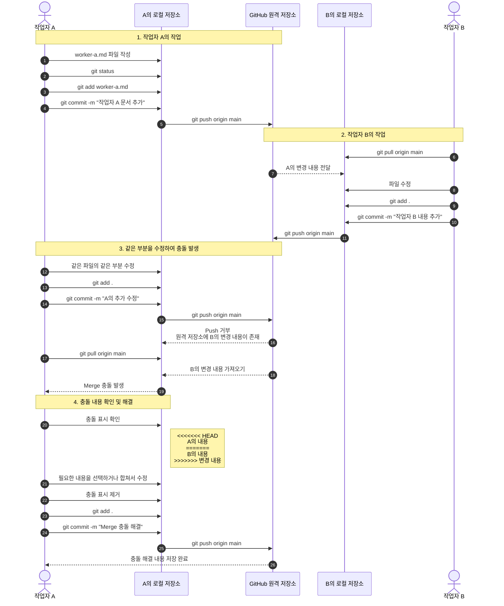

# 2026-git-start
오늘의 학습 목표: 작업자 A·B의 Git 협업 및 Merge 충돌 해결

git status

# 2026 Git Start
GitHub 웹에서 추가한 내용입니다.

# Git 협업 및 Merge 충돌 해결 과정

```mermaid
sequenceDiagram
    autonumber

    actor A as 작업자 A
    participant ARepo as A의 로컬 저장소
    participant GitHub as GitHub 원격 저장소
    participant BRepo as B의 로컬 저장소
    actor B as 작업자 B

    Note over A,GitHub: 1. 작업자 A의 작업

    A->>ARepo: worker-a.md 파일 작성
    A->>ARepo: git status
    A->>ARepo: git add worker-a.md
    A->>ARepo: git commit -m "작업자 A 문서 추가"
    ARepo->>GitHub: git push origin main

    Note over GitHub,B: 2. 작업자 B의 작업

    B->>BRepo: git pull origin main
    GitHub-->>BRepo: A의 변경 내용 전달
    B->>BRepo: 파일 수정
    B->>BRepo: git add .
    B->>BRepo: git commit -m "작업자 B 내용 추가"
    BRepo->>GitHub: git push origin main

    Note over A,GitHub: 3. 같은 부분을 수정하여 충돌 발생

    A->>ARepo: 같은 파일의 같은 부분 수정
    A->>ARepo: git add .
    A->>ARepo: git commit -m "A의 추가 수정"
    ARepo->>GitHub: git push origin main

    GitHub-->>ARepo: Push 거부<br/>원격 저장소에 B의 변경 내용이 존재

    A->>ARepo: git pull origin main
    GitHub-->>ARepo: B의 변경 내용 가져오기
    ARepo-->>A: Merge 충돌 발생

    Note over A,ARepo: 4. 충돌 내용 확인 및 해결

    A->>ARepo: 충돌 표시 확인
    Note right of ARepo: <<<<<<< HEAD<br/>A의 내용<br/>=======<br/>B의 내용<br/>>>>>>>> 변경 내용

    A->>ARepo: 필요한 내용을 선택하거나 합쳐서 수정
    A->>ARepo: 충돌 표시 제거
    A->>ARepo: git add .
    A->>ARepo: git commit -m "Merge 충돌 해결"
    ARepo->>GitHub: git push origin main

    GitHub-->>A: 충돌 해결 내용 저장 완료
```
